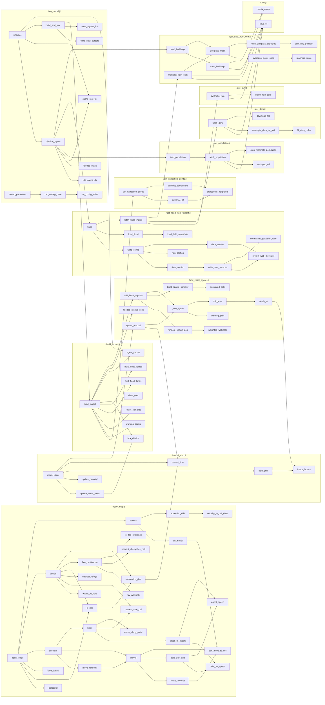

```mermaid
flowchart LR
    subgraph "/add_initial_agents.jl"
        _add_initial_agents_jl__add_agent_["_add_agent!"]
        _add_initial_agents_jl_add_initial_agents_["add_initial_agents!"]
        _add_initial_agents_jl_build_spawn_sampler["build_spawn_sampler"]
        _add_initial_agents_jl_depth_at["depth_at"]
        _add_initial_agents_jl_flooded_rescue_cells["flooded_rescue_cells"]
        _add_initial_agents_jl_populated_cells["populated_cells"]
        _add_initial_agents_jl_random_spawn_pos["random_spawn_pos"]
        _add_initial_agents_jl_risk_level["risk_level"]
        _add_initial_agents_jl_spawn_rescue_["spawn_rescue!"]
        _add_initial_agents_jl_warning_plan["warning_plan"]
        _add_initial_agents_jl_weighted_walkable["weighted_walkable"]
    end
    subgraph "/agent_step.jl"
        _agent_step_jl_advect_["advect!"]
        _agent_step_jl_advection_drift["advection_drift"]
        _agent_step_jl_agent_speed["agent_speed"]
        _agent_step_jl_agent_step_["agent_step!"]
        _agent_step_jl_can_move_to_cell["can_move_to_cell"]
        _agent_step_jl_cells_for_speed["cells_for_speed"]
        _agent_step_jl_cells_per_step["cells_per_step"]
        _agent_step_jl_decide["decide"]
        _agent_step_jl_evacuation_due["evacuation_due"]
        _agent_step_jl_execute_["execute!"]
        _agent_step_jl_flee_destination["flee_destination"]
        _agent_step_jl_flood_status_["flood_status!"]
        _agent_step_jl_help_["help!"]
        _agent_step_jl_is_flee_reference["is_flee_reference"]
        _agent_step_jl_is_idle["is_idle"]
        _agent_step_jl_move_["move!"]
        _agent_step_jl_move_along_path_["move_along_path!"]
        _agent_step_jl_move_around_["move_around!"]
        _agent_step_jl_move_random_["move_random!"]
        _agent_step_jl_nearest_chebyshev_cell["nearest_chebyshev_cell"]
        _agent_step_jl_nearest_refuge["nearest_refuge"]
        _agent_step_jl_nearest_safe_cell["nearest_safe_cell"]
        _agent_step_jl_perceive_["perceive!"]
        _agent_step_jl_ray_walkable["ray_walkable"]
        _agent_step_jl_steps_to_escort["steps_to_escort"]
        _agent_step_jl_try_move_["try_move!"]
        _agent_step_jl_velocity_to_cell_delta["velocity_to_cell_delta"]
        _agent_step_jl_wants_to_help["wants_to_help"]
    end
    subgraph "/build_model.jl"
        _build_model_jl_agent_counts["agent_counts"]
        _build_model_jl_box_dilation["box_dilation"]
        _build_model_jl_build_flood_space["build_flood_space"]
        _build_model_jl_build_model["build_model"]
        _build_model_jl_delta_cost["delta_cost"]
        _build_model_jl_first_flood_times["first_flood_times"]
        _build_model_jl_raster_cell_size["raster_cell_size"]
        _build_model_jl_warning_config["warning_config"]
    end
    subgraph "/get_data_from_osm.jl"
        _get_data_from_osm_jl_fetch_overpass_elements["fetch_overpass_elements"]
        _get_data_from_osm_jl_load_buildings["load_buildings"]
        _get_data_from_osm_jl_manning_from_osm["manning_from_osm"]
        _get_data_from_osm_jl_manning_value["manning_value"]
        _get_data_from_osm_jl_osm_ring_polygon["osm_ring_polygon"]
        _get_data_from_osm_jl_overpass_mask["overpass_mask"]
        _get_data_from_osm_jl_overpass_query_spec["overpass_query_spec"]
        _get_data_from_osm_jl_save_buildings["save_buildings"]
    end
    subgraph "/get_dem.jl"
        _get_dem_jl_download_tile["download_tile"]
        _get_dem_jl_fetch_dem["fetch_dem"]
        _get_dem_jl_fill_dem_holes["fill_dem_holes"]
        _get_dem_jl_resample_dem_to_grid["resample_dem_to_grid"]
    end
    subgraph "/get_extraction_points.jl"
        _get_extraction_points_jl_building_component["building_component"]
        _get_extraction_points_jl_entrance_of["entrance_of"]
        _get_extraction_points_jl_get_extraction_points["get_extraction_points"]
        _get_extraction_points_jl_orthogonal_neighbors["orthogonal_neighbors"]
    end
    subgraph "/get_flood_from_torrent.jl"
        _get_flood_from_torrent_jl_dam_section["dam_section"]
        _get_flood_from_torrent_jl_fetch_flood_inputs["fetch_flood_inputs"]
        _get_flood_from_torrent_jl_flood["flood"]
        _get_flood_from_torrent_jl_load_field_snapshots["load_field_snapshots"]
        _get_flood_from_torrent_jl_load_flood["load_flood"]
        _get_flood_from_torrent_jl_normalized_gaussian_lobe["normalized_gaussian_lobe"]
        _get_flood_from_torrent_jl_project_web_mercator["project_web_mercator"]
        _get_flood_from_torrent_jl_rain_section["rain_section"]
        _get_flood_from_torrent_jl_river_section["river_section"]
        _get_flood_from_torrent_jl_write_config["write_config"]
        _get_flood_from_torrent_jl_write_river_sources["write_river_sources"]
    end
    subgraph "/get_population.jl"
        _get_population_jl_crop_resample_population["crop_resample_population"]
        _get_population_jl_fetch_population["fetch_population"]
        _get_population_jl_load_population["load_population"]
        _get_population_jl_worldpop_url["worldpop_url"]
    end
    subgraph "/get_rain.jl"
        _get_rain_jl_storm_rain_cells["storm_rain_cells"]
        _get_rain_jl_synthetic_rain["synthetic_rain"]
    end
    subgraph "/model_step.jl"
        _model_step_jl_current_time["current_time"]
        _model_step_jl_field_grid_["field_grid!"]
        _model_step_jl_interp_factors["interp_factors"]
        _model_step_jl_model_step_["model_step!"]
        _model_step_jl_update_penalty_["update_penalty!"]
        _model_step_jl_update_water_view_["update_water_view!"]
    end
    subgraph "/run_model.jl"
        _run_model_jl_build_and_run_["build_and_run!"]
        _run_model_jl_cache_root_for["cache_root_for"]
        _run_model_jl_flooded_mask["flooded_mask"]
        _run_model_jl_fsfs_cache_dir["fsfs_cache_dir"]
        _run_model_jl_pipeline_inputs["pipeline_inputs"]
        _run_model_jl_run_sweep_case["run_sweep_case"]
        _run_model_jl_set_config_value["set_config_value"]
        _run_model_jl_simulate["simulate"]
        _run_model_jl_sweep_parameter["sweep_parameter"]
        _run_model_jl_write_agents_init["write_agents_init"]
        _run_model_jl_write_step_outputs["write_step_outputs"]
    end
    subgraph "/utils.jl"
        _utils_jl_matrix_raster["matrix_raster"]
        _utils_jl_save_tif["save_tif"]
    end
    _add_initial_agents_jl__add_agent_ --> _add_initial_agents_jl_risk_level
    _add_initial_agents_jl__add_agent_ --> _add_initial_agents_jl_warning_plan
    _add_initial_agents_jl_add_initial_agents_ --> _add_initial_agents_jl__add_agent_
    _add_initial_agents_jl_add_initial_agents_ --> _add_initial_agents_jl_build_spawn_sampler
    _add_initial_agents_jl_add_initial_agents_ --> _add_initial_agents_jl_random_spawn_pos
    _add_initial_agents_jl_build_spawn_sampler --> _add_initial_agents_jl_populated_cells
    _add_initial_agents_jl_depth_at --> _model_step_jl_interp_factors
    _add_initial_agents_jl_random_spawn_pos --> _add_initial_agents_jl_weighted_walkable
    _add_initial_agents_jl_risk_level --> _add_initial_agents_jl_depth_at
    _add_initial_agents_jl_spawn_rescue_ --> _add_initial_agents_jl__add_agent_
    _add_initial_agents_jl_spawn_rescue_ --> _model_step_jl_current_time
    _agent_step_jl_advect_ --> _agent_step_jl_advection_drift
    _agent_step_jl_advect_ --> _agent_step_jl_try_move_
    _agent_step_jl_advection_drift --> _agent_step_jl_velocity_to_cell_delta
    _agent_step_jl_agent_step_ --> _agent_step_jl_advect_
    _agent_step_jl_agent_step_ --> _agent_step_jl_decide
    _agent_step_jl_agent_step_ --> _agent_step_jl_execute_
    _agent_step_jl_agent_step_ --> _agent_step_jl_flood_status_
    _agent_step_jl_agent_step_ --> _agent_step_jl_is_idle
    _agent_step_jl_agent_step_ --> _agent_step_jl_perceive_
    _agent_step_jl_cells_per_step --> _agent_step_jl_agent_speed
    _agent_step_jl_cells_per_step --> _agent_step_jl_cells_for_speed
    _agent_step_jl_decide --> _agent_step_jl_evacuation_due
    _agent_step_jl_decide --> _agent_step_jl_flee_destination
    _agent_step_jl_decide --> _agent_step_jl_is_idle
    _agent_step_jl_decide --> _agent_step_jl_nearest_refuge
    _agent_step_jl_decide --> _agent_step_jl_nearest_safe_cell
    _agent_step_jl_decide --> _agent_step_jl_wants_to_help
    _agent_step_jl_evacuation_due --> _model_step_jl_current_time
    _agent_step_jl_execute_ --> _agent_step_jl_help_
    _agent_step_jl_execute_ --> _agent_step_jl_move_
    _agent_step_jl_execute_ --> _agent_step_jl_move_random_
    _agent_step_jl_flee_destination --> _agent_step_jl_is_flee_reference
    _agent_step_jl_flee_destination --> _agent_step_jl_nearest_chebyshev_cell
    _agent_step_jl_flee_destination --> _agent_step_jl_ray_walkable
    _agent_step_jl_help_ --> _agent_step_jl_move_along_path_
    _agent_step_jl_help_ --> _agent_step_jl_nearest_safe_cell
    _agent_step_jl_help_ --> _agent_step_jl_steps_to_escort
    _agent_step_jl_is_idle --> _agent_step_jl_evacuation_due
    _agent_step_jl_move_ --> _agent_step_jl_can_move_to_cell
    _agent_step_jl_move_ --> _agent_step_jl_cells_per_step
    _agent_step_jl_move_ --> _agent_step_jl_move_around_
    _agent_step_jl_move_around_ --> _agent_step_jl_can_move_to_cell
    _agent_step_jl_move_random_ --> _agent_step_jl_move_
    _agent_step_jl_steps_to_escort --> _agent_step_jl_agent_speed
    _agent_step_jl_steps_to_escort --> _agent_step_jl_cells_for_speed
    _agent_step_jl_try_move_ --> _agent_step_jl_can_move_to_cell
    _build_model_jl_build_model --> _add_initial_agents_jl_add_initial_agents_
    _build_model_jl_build_model --> _add_initial_agents_jl_flooded_rescue_cells
    _build_model_jl_build_model --> _build_model_jl_agent_counts
    _build_model_jl_build_model --> _build_model_jl_box_dilation
    _build_model_jl_build_model --> _build_model_jl_build_flood_space
    _build_model_jl_build_model --> _build_model_jl_first_flood_times
    _build_model_jl_build_model --> _build_model_jl_raster_cell_size
    _build_model_jl_build_model --> _build_model_jl_warning_config
    _build_model_jl_build_model --> _get_extraction_points_jl_get_extraction_points
    _get_data_from_osm_jl_fetch_overpass_elements --> _get_data_from_osm_jl_osm_ring_polygon
    _get_data_from_osm_jl_load_buildings --> _get_data_from_osm_jl_overpass_mask
    _get_data_from_osm_jl_load_buildings --> _get_data_from_osm_jl_save_buildings
    _get_data_from_osm_jl_manning_from_osm --> _get_data_from_osm_jl_overpass_mask
    _get_data_from_osm_jl_manning_from_osm --> _utils_jl_matrix_raster
    _get_data_from_osm_jl_manning_from_osm --> _utils_jl_save_tif
    _get_data_from_osm_jl_overpass_mask --> _get_data_from_osm_jl_fetch_overpass_elements
    _get_data_from_osm_jl_overpass_mask --> _get_data_from_osm_jl_overpass_query_spec
    _get_data_from_osm_jl_overpass_query_spec --> _get_data_from_osm_jl_manning_value
    _get_data_from_osm_jl_save_buildings --> _utils_jl_matrix_raster
    _get_data_from_osm_jl_save_buildings --> _utils_jl_save_tif
    _get_dem_jl_fetch_dem --> _get_dem_jl_download_tile
    _get_dem_jl_fetch_dem --> _get_dem_jl_resample_dem_to_grid
    _get_dem_jl_fetch_dem --> _utils_jl_save_tif
    _get_dem_jl_resample_dem_to_grid --> _get_dem_jl_fill_dem_holes
    _get_extraction_points_jl_building_component --> _get_extraction_points_jl_orthogonal_neighbors
    _get_extraction_points_jl_entrance_of --> _get_extraction_points_jl_orthogonal_neighbors
    _get_extraction_points_jl_get_extraction_points --> _get_extraction_points_jl_building_component
    _get_extraction_points_jl_get_extraction_points --> _get_extraction_points_jl_entrance_of
    _get_flood_from_torrent_jl_dam_section --> _get_flood_from_torrent_jl_project_web_mercator
    _get_flood_from_torrent_jl_fetch_flood_inputs --> _get_data_from_osm_jl_manning_from_osm
    _get_flood_from_torrent_jl_fetch_flood_inputs --> _get_dem_jl_fetch_dem
    _get_flood_from_torrent_jl_fetch_flood_inputs --> _get_rain_jl_synthetic_rain
    _get_flood_from_torrent_jl_flood --> _get_flood_from_torrent_jl_fetch_flood_inputs
    _get_flood_from_torrent_jl_flood --> _get_flood_from_torrent_jl_load_flood
    _get_flood_from_torrent_jl_flood --> _get_flood_from_torrent_jl_write_config
    _get_flood_from_torrent_jl_load_flood --> _get_flood_from_torrent_jl_load_field_snapshots
    _get_flood_from_torrent_jl_river_section --> _get_flood_from_torrent_jl_write_river_sources
    _get_flood_from_torrent_jl_write_config --> _get_flood_from_torrent_jl_dam_section
    _get_flood_from_torrent_jl_write_config --> _get_flood_from_torrent_jl_rain_section
    _get_flood_from_torrent_jl_write_config --> _get_flood_from_torrent_jl_river_section
    _get_flood_from_torrent_jl_write_river_sources --> _get_flood_from_torrent_jl_normalized_gaussian_lobe
    _get_flood_from_torrent_jl_write_river_sources --> _get_flood_from_torrent_jl_project_web_mercator
    _get_population_jl_fetch_population --> _get_population_jl_crop_resample_population
    _get_population_jl_fetch_population --> _get_population_jl_worldpop_url
    _get_population_jl_fetch_population --> _utils_jl_save_tif
    _get_population_jl_load_population --> _get_population_jl_fetch_population
    _get_rain_jl_synthetic_rain --> _get_rain_jl_storm_rain_cells
    _get_rain_jl_synthetic_rain --> _utils_jl_save_tif
    _model_step_jl_field_grid_ --> _model_step_jl_interp_factors
    _model_step_jl_model_step_ --> _add_initial_agents_jl_spawn_rescue_
    _model_step_jl_model_step_ --> _model_step_jl_current_time
    _model_step_jl_model_step_ --> _model_step_jl_field_grid_
    _model_step_jl_model_step_ --> _model_step_jl_update_penalty_
    _model_step_jl_model_step_ --> _model_step_jl_update_water_view_
    _model_step_jl_update_water_view_ --> _build_model_jl_box_dilation
    _run_model_jl_build_and_run_ --> _build_model_jl_build_model
    _run_model_jl_build_and_run_ --> _run_model_jl_write_agents_init
    _run_model_jl_build_and_run_ --> _run_model_jl_write_step_outputs
    _run_model_jl_pipeline_inputs --> _get_data_from_osm_jl_load_buildings
    _run_model_jl_pipeline_inputs --> _get_flood_from_torrent_jl_flood
    _run_model_jl_pipeline_inputs --> _get_population_jl_load_population
    _run_model_jl_pipeline_inputs --> _run_model_jl_cache_root_for
    _run_model_jl_pipeline_inputs --> _run_model_jl_flooded_mask
    _run_model_jl_pipeline_inputs --> _run_model_jl_fsfs_cache_dir
    _run_model_jl_run_sweep_case --> _run_model_jl_set_config_value
    _run_model_jl_simulate --> _build_model_jl_agent_counts
    _run_model_jl_simulate --> _run_model_jl_build_and_run_
    _run_model_jl_simulate --> _run_model_jl_cache_root_for
    _run_model_jl_simulate --> _run_model_jl_pipeline_inputs
    _run_model_jl_sweep_parameter --> _run_model_jl_run_sweep_case
```
